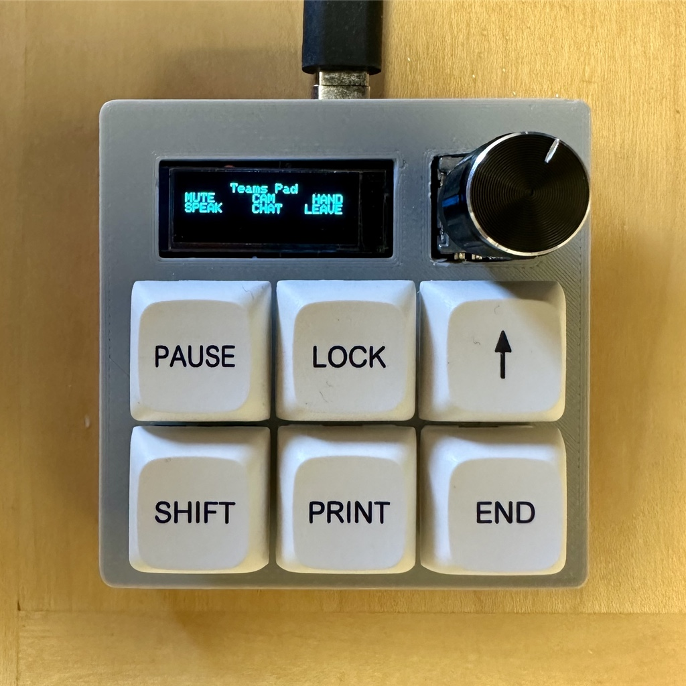
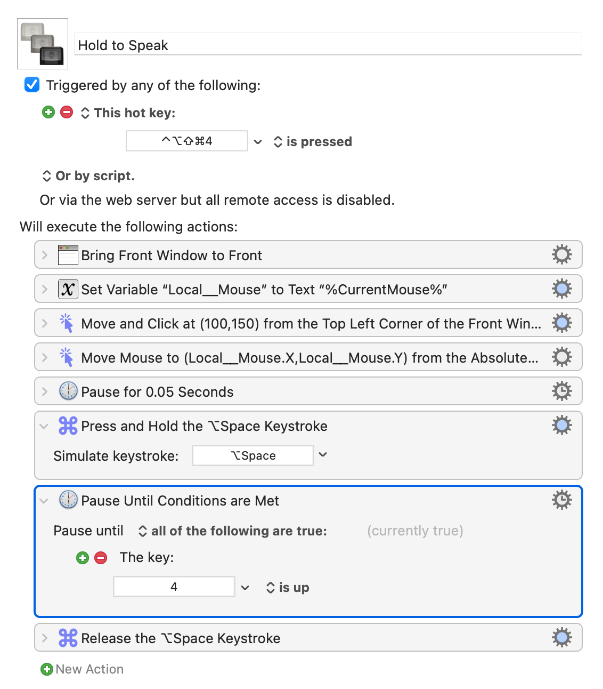

# Building a Macropad for Microsoft Teams using Keyboard Maestro

Several months ago, I built a [macropad](https://github.com/GitSimon8/3x3Macropad). This was a fun project, but I never really had a specific purpose for it. Then last week, there was a Reddit post about using a macropad with Microsoft Teams. Ah ha! Now I had a purpose. Unfortunately, the post did not go into much detail about the specific functionality that was implemented. To help you avoid the same fate, here is some detail about how I accomplished this.

**tl;dr** I used the wonderful-but-Mac-only [Keyboard Maestro](https://www.keyboardmaestro.com) (KM). If you just want to grab the macros and run, you can [skip to the end](#download)

If you do use a Mac, I would strongly encourage you to invest in Keyboard Maestro to make your life better. (If you are on Windows, I understand [AutoHotkey](https://www.autohotkey.com) can accomplish much of the same functionality, but that is a story for someone else to tell.)

The macropad kit I built is _called_ "3x3Macropad", but in the configuration I built, it has 2 rows of 3 keys each, a small OLED screen, and a rotary encoder (a knob).

So I have 6 keys I can script for Teams functionality. Here's what I decided to implement:

1. Toggle mic (mute/unmute)
2. Toggle camera on/off
3. Raise/lower hand
4. Push to speak
5. Open chat sidebar
6. Leave meeting

## Key Binding

I programmed my macropad so that each key is bound to a unique key code combination, that does not already exist on my (65% mechanical) keyboard. The QMK firmware I created (not as hard as it sounds) binds `hyper + <num>` to each key. On Mac, the OS sees the hyper key press as sending `ctrl + alt + cmd + shift` (`^⌥⌘⇧`). This makes it easy to create a unique key combination that you can attach a script or macro to.

So the first key on the macropad sends `hyper + 1`, which the OS sees as `^⌥⌘⇧1`. This helps ensure you don't accidentally trigger this macro without specifically meaning to.

## Scripting

Microsoft Teams is an app built with Electron, so it's not a "real" Mac app, which makes it more challenging to script. Some of the functions have keyboard shortcuts, and some just don't, but even for the ones that do, they are not universal shortcuts, which means they only work when Teams is the foremost app, _and_ has the focus. Ideally, I'd like to have a macro that first activates Teams, and then sends the necessary keyboard shortcut, so that we can press the macropad key no matter what app is active, and have it work for the current Teams call. One reason to build a KM macro, instead of just binding the specific key combo to the macropad key (which you could do with QMK), is so that we can first active and focus Teams, and then send the shortcut. The disadvantage of doing this is that your macropad has dependencies, rather than being self-contained.

**Tip:** To test these macros, you need to be in a Teams call. You can easily create a Teams call that only you are in, by going to your Calendar in Teams, and clicking the "Meet Now" button in the top-right.

### Toggle Mic (Mute/Unmute)

This one is pretty straightforward, because Teams already has a keyboard shortcut it recognizes to toggle mute: `⌘+Shift+M`. However, this shortcut only works if Teams is the foremost app, **and** it has the focus (simply bringing the Teams app to the front doesn't give it the focus). So this KM macro:

1. Bring the Teams app to the front
2. Store the current location of your mouse
3. Move the mouse to a specific location from the top-right corner of the front window, and clicks, to give the front window the focus
4. Move the mouse back to where it was
5. Pause for a very short time (otherwise didn't seem to work reliably)
6. Send the `⌘+Shift+M` keystroke

This same process of first activating and focusing on Teams is used in most of the other macros.

### Toggle Video

This function also has a built-in keyboard shortcut (`⇧⌘O`), so use the exact same process as toggling the mic.

### Raise/Lower Hand

Also has a shortcut (`⇧⌘K`), so lather, rinse, repeat.

### Hold to Speak

The functionality of this key is similar to the "mute/unmute" function, but works slightly differently. _If you are already muted_, you can hold down the desired key to temporarily unmute the mic. As soon as you release the key, you will go back to being muted. This helps to reduce the dreaded SWM (speaking while muted) syndrome.

This macro was the most challenging to implement, because you need to activate Teams, send a key press combination while the key is held down, and then stop sending that key press when you release the macropad key.

Here's the KM steps I ended up with:

1. Bring the Teams app to the front
2. Store the current location of your mouse
3. Move and click the mouse in the Teams window to give it the focus
4. Return mouse to previous location
5. Pause very briefly
6. Press-and-hold the `⌥Space` keystroke
7. Pause until the "4" key is released[^1]
8. Release the `⌥Space` keystroke

[^1]: I bound my "hold to speak" macro to a key with a key code of `hyper + 4`. KM can only watch a single key press for the "pause until ... released" action, so I had to use one of the keys that was already being held down, and a non-modified key, to watch for when to release the keystroke.

### Open Chat Sidebar

The button to open the chat sidebar ("Chat" in the top Teams navbar) does not have an associated keyboard shortcut. The button is also right-aligned, which means as you re-size your meeting window, it stays in the same relative position, compared to the _top-right_ corner of the window. So I created a KM macro to move the mouse to an exact pixel measurement from the _top-right_ corner of the window.

1. Bring the Teams app to the front
2. Store the current location of your mouse
3. Move and click the mouse in the Teams window to give it the focus
4. Move to a specific pixel offset[^2] from the top-right corner of the front window
5. Return mouse pointer to the previous location

[^2]: How do you know exactly how many pixels it is the to location you want to click? Keyboard Maestro has a handy "get" function--it counts down from 5 seconds, giving you enough time to move the mouse exactly where you want it to be--and then it records the number of pixels relative to the active window.

### Leave Call

This function also has a built-in keyboard shortcut (`⇧⌘H`)

##  Download the Macros

These are the Keyboard Maestro macros I created (that work for me on a MacBook Pro running MacOS Monterey 12.6.1. YMMV). To install, download and double-click each file, or use the "File > Import..." menus in KM.

- [teams_toggle_mic.kmmacros](../assets/files/2022-12-13/teams_toggle_mic.kmmacros)
- [teams_toggle_video.kmmacros](../assets/files/2022-12-13/teams_toggle_video.kmmacros)
- [teams_raise_lower_hand.kmmacros](../assets/files/2022-12-13/teams_raise_lower_hand.kmmacros)
- [teams_hold_to_speak.kmmacros](../assets/files/2022-12-13/teams_hold_to_speak.kmmacros)
- [teams_open_chat.kmmacros](../assets/files/2022-12-13/teams_open_chat.kmmacros)
- [teams_leave_call.kmmacros](../assets/files/2022-12-13/teams_leave_call.kmmacros)

## Summary

Keyboard Maestro is a very capable automation tool for the Mac. It sometimes requires a bit of experimentation, in order to figure out what works for the specific task you want to perform, but there generally is a way.

I'm sure these macros are not the only or best way to automate Teams, so if you have a better solution, i'd love to hear it!

Having a macropad with Teams-specific functionality has been a great tool for making those incessant video calls just a little better.
